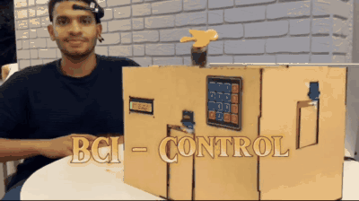

# Brain-Computer Interface for Smart Home Control

A real-time brain-computer interface that controls doors, windows and a fan
from single-channel EEG. A NeuroSky MindWave Mobile 2 headset streams band
powers, eye-blink strength and attention and meditation readings to a PC, which
sends commands over serial to an ESP32 that drives the servos and fan. Two
CNN-BiLSTM models classify blink type and attention and relaxation level.

It is built for people with motor impairments, paralysis or neuromuscular
conditions — control that needs no hands.



Graduation project, Faculty of Computer and Data Science, Alexandria University,
2025.

---

## Results

| task                            | protocol             | accuracy        | macro F1 |
| ------------------------------- | -------------------- | --------------- | -------- |
| blink type                      | window-level split   | ~92%            | —        |
| blink type                      | held-out session     | 88.4% ± 1.7     | 0.864    |
| blink type, band powers only    | held-out session     | 65.4% ± 3.5     | 0.496    |
| blink type, threshold rule      | held-out session     | 93.0% ± 1.0     | 0.925    |
| blink type, majority class      | held-out session     | 47.5% ± 2.7     | 0.214    |
| attention                       | window-level split   | 92%             | 0.91     |
| attention                       | held-out session     | 52.6% ± 9.4     | 0.449    |
| attention, majority class       | held-out session     | 56.4% ± 5.8     | 0.240    |
| relaxation                      | window-level split   | 90%             | 0.85     |
| relaxation                      | held-out session     | 69.1% ± 8.9     | 0.386    |
| relaxation, majority class      | held-out session     | 71.6% ± 2.8     | 0.278    |

The window-level rows use a stratified random split over overlapping windows;
the held-out-session rows use five-fold cross-validation grouped by session.
Full tables are in [`evaluation/REPORT.md`](evaluation/REPORT.md).

### Cross-session evaluation

The blink classifier was also tested on recording sessions it never saw.
`blink_control/session_cv.py` retrains the same model — same windows, features,
architecture and loss — under 5-fold cross-validation grouped by session, so
every window of a session falls in a single fold and no session contributes to
both training and test.

| metric   | result            |
| -------- | ----------------- |
| accuracy | **88.4% ± 1.7**   |
| macro F1 | 0.864 ± 0.021     |

| class    | precision | recall | F1   |
| -------- | --------- | ------ | ---- |
| no blink | 0.99      | 0.96   | 0.97 |
| single   | 0.87      | 0.91   | 0.89 |
| double   | 0.76      | 0.70   | 0.73 |

Under five-fold cross-validation grouped by session, the classifier reaches
88.4% ± 1.7, with fold accuracies between 86.3% and 91.2%. The
threshold-and-timing rule that produces the labels reaches 93.0% ± 1.0 under
the same folds, and a variant with the blink-strength channel and its derived
features removed reaches 65.4% ± 3.5 against a 47.5% majority baseline.
Double blinks remain the hardest class: 241 of 835 double-blink windows were
read as singles. The dataset does not record subject identity, so this holds
out sessions rather than people.
Per-fold results are in `blink_control/session_cv_results.json`.

### Architecture ablation

Same windows, loss, schedule and folds; only the architecture changes, under
the held-out-session protocol.

| variant                         | parameters | accuracy | macro F1 |
| ------------------------------- | ---------- | -------- | -------- |
| CNN only                        | 10,243     | 68.2%    | 0.533    |
| CNN + BiLSTM                    | 66,051     | 78.1%    | 0.596    |
| CNN + BiLSTM + dense branch     | 68,467     | 88.4%    | 0.864    |

The shared multi-task backbone uses 291,078 parameters, against 573,446 for two
independent single-task models.

---

## Data

### Collection

Recorded with the NeuroSky MindWave Mobile 2: a single dry electrode on the
forehead and a reference clip on the ear, streamed through the ThinkGear
Connector.

- **36 sessions**, with participants of different genders and age groups
- **Tasks:** single and double blinks, attention focus (concentration tasks),
  and relaxation (a calm state with minimal cognitive load)
- **Setting:** controlled environment to reduce noise and artifacts, with
  standardised instructions and supervised collection

Each sample carries eight EEG band powers (delta, theta, low and high alpha, low
and high beta, low and high gamma), the headset's attention and meditation
values (0–100), and its blink-strength reading.

### Datasets

| file                                | samples | labels                                                 |
| ----------------------------------- | ------- | ------------------------------------------------------ |
| `data/all_data_labeled_final6.csv`  | 13,229  | blink type — 4,518 no blink, 6,030 single, 2,681 double |
| `data/all_data_labeled_att_Rel.csv` | 5,929   | attention and relaxation level                          |

---

## Labeling

### Blink type

The `blinkType` column holds one of three classes:

| value | class      | rule                                                           |
| ----- | ---------- | -------------------------------------------------------------- |
| 0     | no blink   | no blink-strength reading meets the threshold                  |
| 1     | single     | one blink meeting the blink-strength threshold of 60           |
| 2     | double     | two blinks, each meeting the threshold, within 1 second        |

`blinkStrength >= 60` agrees with `blinkType > 0` on 100% of samples, so blink
versus no blink is decided entirely by the threshold, and `blinkStrength` is
also one of the model's twelve input columns. Fuzzy confidence at strength 60
is 0.560, so a gate below that value cannot reject a genuine event.

### Attention and relaxation level

Attention and relaxation labels come from the headset's attention and
meditation values, binned into three levels
(`mind_state_control/att_rel_label_logic.ipynb`):

| level  | value    |
| ------ | -------- |
| low    | below 34 |
| medium | 34–66    |
| high   | 67–100   |

`attention` gives `attention_label` and `meditation` gives `relaxation_label`.
The resulting classes are 1,218 low, 3,144 medium and 1,567 high for attention,
and 862 low, 3,803 medium and 1,264 high for relaxation.

---

## Models

**Blink classifier** (`blink_control/Blink_model.ipynb`). Each input is a
window of 20 consecutive samples, taking the label of its last sample. The
network has two branches: a CNN-BiLSTM over the window's 12 input columns, and a
dense branch over 30 engineered statistics — blink-strength summaries, the
interval between blinks, and per-band means and deviations. The branches merge
before a three-way softmax. It is trained with focal loss, which weights the
rarer double blinks more heavily, using early stopping and learning-rate
reduction on validation loss.

**Mind-state classifier** (`mind_state_control/att_rel_model.ipynb`). A single
CNN-BiLSTM with two softmax heads predicts attention and relaxation level
together, from windows of 20 samples over 66 engineered features: band powers,
band ratios such as theta/beta and alpha/beta, rolling statistics, deltas and
normalised power.

| model                | window             | windows            | split                                             |
| -------------------- | ------------------ | ------------------ | ------------------------------------------------- |
| blink                | 20 samples, step 3 | 4,049              | stratified, 70% train / 15% validation / 15% test |
| blink, cross-session | 20 samples, step 3 | 4,049              | 5-fold, grouped by session                        |
| mind state           | 20 samples, step 2 | 2,955 (591 test)   | stratified, 80% train / 20% test                  |

Blink windows are confined to a single session. Mind-state windows are built
across the concatenated file, giving 2,955, of which 591 form the 20% test
split.

---

## How it works

```
NeuroSky headset ─▶ ThinkGear Connector ─▶ Python controller ─▶ USB serial ─▶ ESP32 ─▶ servos, fan
                    (Telnet :13854)
```

Model inference runs on the host machine; the ESP32 is the actuation and
safety controller, driving the servos and fan and running the keypad lock and
hazard alarms. The headset emits roughly one sample per second (mean interval
0.98 s), so a 20-sample window spans about 19.6 seconds.

**Blinks open the door and window** (`blink_control/main.py`). A single blink
turns the door servo to 90°; a double blink, two blinks inside the timing
window, turns the window servo. A scikit-fuzzy system scores the confidence of
each blink from its strength.

**Mental state sets the fan speed** (`mind_state_control/main_att.py`).
Attention and meditation are smoothed over 15 samples and passed through a
scikit-fuzzy controller that weighs the two against each other and steps the
fan's PWM up or down.

Both trained models run on the live stream and print their predictions to the
console as the controllers operate.

### Hardware

| component                     | role                                              |
| ----------------------------- | ------------------------------------------------- |
| NeuroSky MindWave Mobile 2    | EEG headset                                       |
| ESP32 DevKit v1               | main controller; receives commands over serial    |
| servo motors                  | door and window                                   |
| DC fan with motor driver      | speed set by PWM                                  |
| 4×4 keypad                    | password entry for the door                       |
| 16×2 I2C LCD                  | system status, temperature and humidity           |
| AHT21B sensor                 | temperature and humidity                          |
| gas and flame sensors, buzzer | hazard alarms                                     |
| Arduino Uno                   | secondary controller for LED lighting             |

The ESP32 firmware (`arduino/final_esp32.ino`) runs the keypad lock, hazard
alarms and environment display alongside the EEG commands.

### Mobile app

A Flutter app (`mobile_app/smart_home_app-main/`) is in progress as the
interface for remote control, with sign-in, room navigation, device controls,
and temperature, humidity and safety-alert display. Firebase is the planned
backend.

---

## Running

Requires the NeuroSky headset paired and the ThinkGear Connector running on
`localhost:13854`, with the ESP32 connected over USB. The serial port is set to
`COM4` in both controllers; change it to match your machine.

```bash
pip install -r requirements.txt
```

Run one controller from its own directory, since each loads its model and
preprocessing files by relative path:

```bash
cd blink_control
python main.py        # blinks control the door and window
```

```bash
cd mind_state_control
python main_att.py    # attention and meditation control the fan
```

Use Python 3.12 or earlier: the controllers use `telnetlib`, which was removed
in Python 3.13. `requirements.txt` also covers the training notebooks, which
read their CSV from the working directory.

To reproduce the cross-session evaluation, run from the repository root:

```bash
python blink_control/session_cv.py
```

---

## Repository layout

```
blink_control/
  Blink_model.ipynb              blink classifier training and evaluation
  session_cv.py                  cross-session evaluation of the blink classifier
  session_cv_results.json        its per-fold results
  main.py                        real-time blink control
  fuzzy_logic.py                 blink confidence rules
  best_eeg_cnn_bilstm_focal.h5   trained blink model
  scaler_feats.pkl, scaler_seq.pkl, windowed_feature_cols.json,
  preprocessing_meta.json        preprocessing saved for inference
mind_state_control/
  att_rel_label_logic.ipynb      attention and relaxation labeling
  att_rel_model.ipynb            mind-state classifier training and evaluation
  main_att.py                    real-time fan control
  fuzzy_logic_att.py             attention and meditation to fan speed
  best_eeg_cnn_bilstm.h5         trained dual-output model
  feature_cols.json, le_att_classes.npy, le_rel_classes.npy
data/
  all_data_labeled_final6.csv    blink dataset
  all_data_labeled_att_Rel.csv   attention and relaxation dataset
arduino/
  final_esp32.ino                ESP32 firmware
  arduino.ino                    Arduino Uno sketch
mobile_app/smart_home_app-main/  Flutter app
demo/
  bci_blink_control.gif          blink control clip from the demo video
  BCI for Smart Home control Demo.mp4
requirements.txt                 Python dependencies for controllers and notebooks
LICENSE                          educational and research use
```

A demo video is in `demo/`:
[demo video](demo/BCI%20for%20Smart%20Home%20control%20Demo.mp4).

---

## Credits

### Authors

Moustafa Taher, Omar Ali, Mahmoud Gamal

Faculty of Computers and Data Science, Alexandria University, Alexandria, Egypt

### Acknowledgments

We extend our sincere gratitude to Belal Moustafa Osman, Omar Sameh Said, Hamid
Mohamed Abdelhamid, Mohamed Ragab Mohamed, Anas Bakr Mohamed, Mina Ehab Milad,
and Mohamed Hatem, whose support and collaboration have been essential to the
completion of this work. We also thank the Faculty of Computers and Data
Science, Alexandria University, for institutional support.

Graduation project, Faculty of Computers and Data Science, Alexandria
University, 2025.

## Citation

<!-- TODO: replace with the published reference once the paper is out. -->

> Moustafa Taher, Omar Ali, Mahmoud Gamal, "MindAssist: A Hybrid CNN–BiLSTM
> Brain–Computer Interface with Fuzzy-Logic Postprocessing for Accessible
> Smart-Home Control Using a Single-Channel EEG Headset," submitted, 2026.

## License

Educational and non-commercial research use; see [LICENSE](LICENSE). Clinical
or commercial use, including adaptation, requires written permission from the
authors. This is not a medical device.
